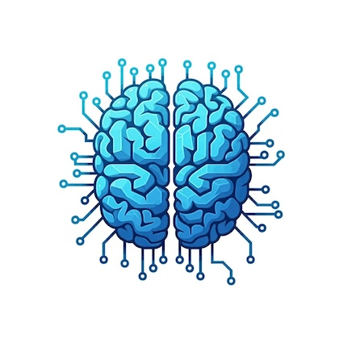

# SwiftNeuron

This repository explores the implementation of a basic neuron in Swift. The goal is to understand the fundamental building blocks of neural networks by building them from scratch, without relying on external machine learning libraries.

## Why build a neuron in Swift?

* **Deeper Understanding:** Implementing a neuron from scratch provides valuable insights into how neural networks work at a fundamental level.
* **Swift Proficiency:** This project helps enhance Swift programming skills by applying them to a challenging and relevant domain.
* **Foundation for Future Development:** This basic neuron implementation serves as a foundation for building more complex neural networks and deep learning models in Swift.
* **Potential for Performance:** Swift, being a compiled language, offers potential performance advantages for computationally intensive tasks like neural network training and inference.

## Current Features

* **Neuron Class:** A `Neuron` class that takes weights and bias as input.
* **Weighted Sum Calculation:**  Calculates the weighted sum of inputs and adds the bias.
* **Output Rounding:** Rounds the neuron's output to a specified number of decimal places.

## Future Enhancements

* **Activation Functions:** Implement various activation functions (sigmoid, ReLU, tanh) to introduce non-linearity.
* **Learning Algorithm:** Implement a learning algorithm (e.g., backpropagation) to train the neuron on data.
* **Layer Construction:**  Build layers of neurons and connect them to form multi-layer networks.
* **Network Architectures:** Explore different network architectures (feedforward, convolutional, recurrent).
* **Real-world Applications:** Apply the developed neural networks to solve real-world problems.

## Getting Started

1. Clone this repository.
2. Open the `SwiftNeuron.swift` file in Xcode.
3. Run the code to see the neuron in action.

## Contributing

Contributions are welcome! Feel free to open issues or submit pull requests for bug fixes, improvements, or new features.
